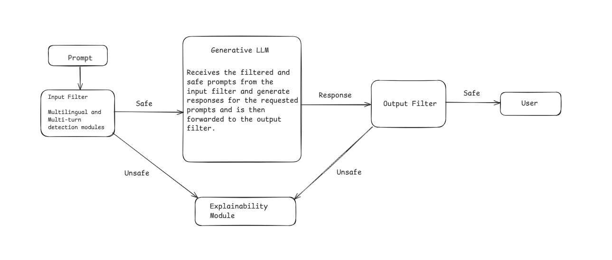

# XJailGuard

**Secure Multilingual AI Assistant for Safe LLM Deployment**

---

## Overview

XJailGuard is an advanced framework designed to safeguard generative Large Language Models (LLMs) against prompt-based attacks (jailbreaks) and unsafe content, especially in multilingual and multi-turn conversational scenarios. The system combines filtering and explainability modules to ensure that only safe prompts and responses reach the user, with transparency on how decisions are made.

---

## Architecture



*Flow of prompt, filtering, LLM, output filter, and explainability—ensuring only safe responses reach the user.*

**System Flow:**
1. **Prompt Input**
   - The user submits a prompt, which enters the system.

2. **Input Filter**
   - Uses multilingual and multi-turn detection modules to assess if the input is safe.
   - Unsafe prompts are blocked and explained to the user via the Explainability Module.
   - Safe prompts are forwarded to the generative LLM.

3. **Generative LLM**
   - Receives filtered and safe prompts.
   - Generates a response, which is then sent to the Output Filter.

4. **Output Filter**
   - Checks the generated response for safety.
   - Unsafe responses are intercepted and explained.
   - Safe responses are passed to the user.

5. **Explainability Module**
   - Whenever content is blocked (either input or output), SHAP (SHapley Additive exPlanations) values are computed to show which tokens contributed to the classification as unsafe, providing transparency and actionable feedback.

---

## How It Works

### 1. Model Loading

Essential models are loaded at startup or lazily as needed:

- **Multilingual Classifier**  
  Loads a sequence classification model (`Yashaswini21/multilingual_new1_continued`) to detect unsafe input prompts, supporting multiple languages.

- **LLM Model**  
  Uses Vicuna 7B (`TheBloke/Wizard-Vicuna-7B-Uncensored-HF`). This model is loaded in 4-bit mode with bitsandbytes for efficient inference.

- **Output Filter Model**  
  Loads a classifier from the `output_filter` subfolder of `khrshtt/XJailGuard` to evaluate the safety of responses.

- **Multi-turn Filter Model**  
  Loads a classifier for multi-turn detection from the `multi_turn` subfolder.

Example code for model loading:
```python
# Load classifier and filter models
cls_tokenizer = AutoTokenizer.from_pretrained(classification_model_name, **use_auth)
cls_model = AutoModelForSequenceClassification.from_pretrained(classification_model_name, **use_auth).to(device).eval()
output_filter_tokenizer = AutoTokenizer.from_pretrained(output_filter_repo, subfolder=output_filter_subfolder, **use_auth)
output_filter_model = AutoModelForSequenceClassification.from_pretrained(output_filter_repo, subfolder=output_filter_subfolder, **use_auth).to(device).eval()
multiturn_tokenizer = AutoTokenizer.from_pretrained(output_filter_repo, subfolder=multi_turn_subfolder, **use_auth)
multiturn_model = AutoModelForSequenceClassification.from_pretrained(output_filter_repo, subfolder=multi_turn_subfolder, **use_auth).to(device).eval()
```
LLM is loaded lazily when a prompt is first processed:
```python
vicuna_model = AutoModelForCausalLM.from_pretrained(vicuna_model_name, quantization_config=bnb_config, device_map="auto", trust_remote_code=True)
vicuna_tokenizer = AutoTokenizer.from_pretrained(vicuna_tokenizer_name, trust_remote_code=True)
```

### 2. Filtering and Explainability

- **Input Filter Function**  
  Checks if the prompt is "benign" or a "jailbreak". If unsafe, computes SHAP values for explainability.

- **Output Filter Function**  
  Evaluates model responses for safety. Unsafe outputs trigger explainability via SHAP.

- **Multi-turn Detection**  
  Assesses the context of previous conversation turns for jailbreak chains.

Sample input filter usage:
```python
input_pred = input_filter([user_prompt])
if input_pred['label'] == 'jailbreak':
    exp_data = explain_shap_values(single_turn_explainer, user_prompt, input_pred.get('pred_idx', 1), original_text=user_prompt)
    # Block prompt, display explanation
```

### 3. Conversational Agent

The main agent coordinates filtering, translation (for non-English prompts), LLM response generation, and final output filtering. Unsafe content at any stage is explained to the user.

Snippet for agent initialization:
```python
agent = ConversationSafeAgent(
    input_filter=input_filter_func,
    output_filter=output_filter_func,
    single_turn_explainer=single_turn_explainer,
    multiturn_explainer=multiturn_explainer,
    model_func=generate_llm_response,
    max_context_turns=2
)
```

---

## User Interface

Built with Gradio, XJailGuard provides an interactive chat interface where users can submit prompts and receive safe, filtered responses. If content is blocked, a data frame shows which tokens caused the block.

---

## Features

- **Multilingual Support:** Detects and processes input in multiple languages.
- **Multi-turn Safety:** Checks not just single prompts but conversation history for chained jailbreaks.
- **Explainability:** SHAP-based token-level explanations for every blocked prompt or response.
- **Efficient LLM Loading:** Uses bitsandbytes for memory-efficient model inference.
- **Transparent Filtering:** Both input and output are filtered for safety before reaching the user.

---

## Getting Started

1. Clone the repository and run the main notebook (`XJailGuard.ipynb`) in your preferred environment.
2. Make sure you have the required dependencies (`transformers`, `gradio`, `shap`, etc.) installed.
3. Add your architecture diagram image as `architecture.png` to the repo root (or edit the README image path if placed elsewhere).

---

## License

This project currently does not specify a license. Please contact the repository owner for usage permissions.

---

## Author

- GitHub: [karash10](https://github.com/karash10)

---

## Links

- [XJailGuard on GitHub](https://github.com/karash10/XJailGuard)
